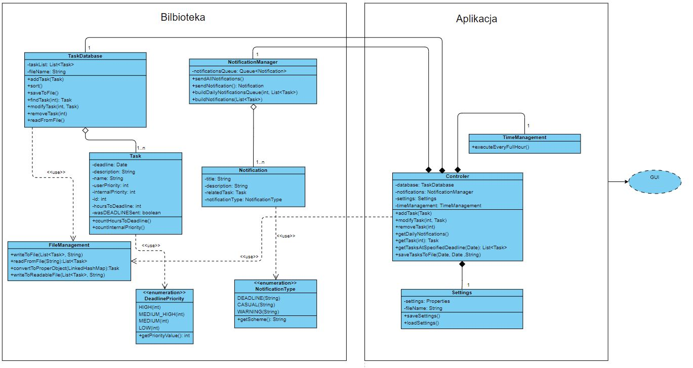

# Diagram Klas
Link: [Diagram Klas](https://online.visual-paradigm.com/community/share/class-diagram-order-process-jelbj3y11)

# Biblioteka:

## Task

1. Atrybuty:
	- id: int - pozwala na jednoznaczną identyfikację zadania.
	- name: String – nazwa zadania nadana przez użytkownik.  
	- description: String – atrybut przechowujący opis zadania; może zawierać na przykład notatkę opisującą miejsce, szczegóły spotkania itd.    
	- deadline: Date – informacja o ostatecznym terminie wykonania zadania   .
	- userPriority: int – subiektywny priorytet w skali od 0 do 10  nadawany przez użytkownika.   
	- InternalPriority: int – priorytet zadania określany przez system na podstawie ilości pozostałego czasu, ogólnej ilości zadań oraz userPriority.    
	- hoursToDeadline: int - obliczany czas do terminu wykonania zadania (deadline).
	- wasDEADLINESent: boolean - informacja czy zostało już wysłane powiadomienie typu DEADLINE.

2. Metody:
	- countHoursToDeadline() – oblicza i aktualizuje atrybut hoursToDeadline.
	- countInternalPriority() - oblicza i aktualizuje atrybut InternalPriority.

## TaskDatabase

1. Atrybuty:
	- taskList: List<Task> - lista przechowująca zadania do wykonania	    
	- fileName: String – nazwa pliku json, w którym przechowywane są aktywne zadania

2. Metody:
	- addTask(Task) - umożliwia dodanie Task do taskList.	    
	- sort() - sortuje  taskList na podstawie internalPriority.    
	- saveToFile() - zapisuje taskList do pliku json.    
	- readFromFile() - odczytuje  taskList z pliku json.    
	- findTask(int): Task – zwraca zadanie o określonym id   
	- modifyTask(int, Task) - pozwala zmodyfikować Task o podanym id; obiekt Task o id podanym jako parametr metody zostaje zamieniony na obiekt Task podany w parametrze pamiętając o zachowaniu poprzedniego id.   
	- removeTask(int) - usuwa Task o podanym id.

## FileManagement
Klasa implementująca metody zapisu i odczytu plików json w oparciu o bibliotekę jackson. Metody wykorzystywane są przez klasę TaskDatabase.

1. Atrybuty:

2. Metody:
	- writeToFile(List<Task>, String) - zapisuje obiekt List do pliku json o nazwie podanej jako parametr metody.
	- readFromFile(String): List<Task> - odczytuje obiekt List z pliku json o nazwie podanej jako parametr metody.
	- convertToProperObject(LinkedHashMap): Task – tworzy obiekt Task z LinkedHashMap; typ przekazywanego obiektu w parametrze metody nie jest wiążący, w zależności od zastosowanej implementacji może występować inny typ danych (wykonując testy zauważyliśmy, że biblioteka jackson przy odczycie Listy z pliku json domyślnie zwraca listę  obiektów LinkedHashMap).
	- writeToReadableFile(List<Task>, String) - zapisuje przekazany List<Task> do pliku.txt o podanej nazwie; Plik jest czytelny i przejrzysty, ponieważ użytkownik może chcieć wygenerować go jako listę zadań na najbliższy okres czasu.

## Notification

1. Atrybuty:
	- title: String  - tytuł powiadomienia
	- description: String – opis - główna treść powiadomienia.
	- relatedTask: Task – Task z powodu którego zostało przygotowane powiadomienie
	- notificationType: NotificationType - jeden ze zdefiniowanych rodzajów powiadomienia w klasie enum; określa między innymi wygląd powiadomienia.

2. Metody:

## NotificationType \<\<enumeration\>\>
Definiuje typy powiadomień oraz odpowiadające im schematy:  
	- DEADLINE – w niedługim czasie mija czas zakończenia zadania  
	- CASUAL – powiadomienie wygenerowane na podstawie posortowanego listTask z TaskDatabase  
	- WARNING – minął już czas zakończenia zadania (deadline)   
1. Atrybuty:
	- scheme: String – zawiera schemat powiadomienia

2. Metody:

## NotificationManager
Klasa zarządzająca tworzeniem, przechowywaniem i przekazywaniem powiadomień

1. Atrybuty:
	- notificationsQueue: Queue<Notification> - kolejka przechowująca powiadomienia do przekazania użytkownikowi; kolejka z określoną ilością dziennych powiadomień (typ CASUAL) generowana jest chwile przed przekazaniem ich; w przypadku wygenerowania powiadomienia typu WARNING lub DEADLINE powiadomienie dodawane jest do kolejki i natychmiastowo przekazywane użytkownikowi.

2. Metody:
	- sendNotification(): Notification - przekazuje obiekt z początku kolejki notificationQueue i usuwa go.
	- sendAllNotifications() - wywołuje kilkukrotnie metodę sendDailyNotifications do momentu kiedy kolejka będzie pusta.
	- buildNotifications(List<Task>) - jeżeli dla któregoś z Tasków spełnione są warunki utworzenia powiadomienia typu DEADLINE lub WARNING tworzy oraz dodaje powiadomienia.
	- buildDailyNotifications(int, List<Task>) - buduje notificationsQueue o określonej wielkości na podstawie przekazanego taskList z TaskDatabase; w przypadku gdy notificationsQueue zawiera już obiekty nie są one usuwane, dodawana jest odpowiednia ilość, żeby spełnić warunek wielkości;

-------------------------------------------------------------------------------
# Aplikacja:

## Settings

Klasa zarządzająca ustawieniami aplikacji

1. Atrybuty:
	- settings: Properties – przechowuje ustawienia
	- fileName: String – nazwa pliku przechowującego ustawienia

2. Metody:
	- saveSettings() - zapisuje obiekt Properties do pliku o nazwie fileName.
	- loadSettings() - ładuje obiekt Properties z pliku o nazwie fileName.

3. Przykładowa struktura pliku zawierającego ustawienia:   
PreferedDailyNotificationTime=value   
StartOfWorkingTime=value  
EndOfWorkingTime=value   
NumberOfDaliyNotifications=value  
DEADLINENotificationBeforeDeadline=value

4. Objaśnienia
	- PreferedDailyNotificationTime- godzina w formacie HH:MM, mówiący kiedy mają zostać wysłane dzienne powiadomienia  
	- StartOfWorkingTime- preferowana godzina w formacie HH:MM, od której możemy zacząć wysyłać powiadomienia  
	- EndOfWorkingTime- preferowana godzina w formacie HH:MM, do której możemy wysyłać powiadomienia  
	- NumberOfDaliyNotifications- ilość powiadomień wysyłanych o godzinie zapisanej w PreferedDailyNotificationTime. Określa ona ile Tasków zostanie dodanych do kolejki notificationsQueue.  
	- DEADLINENotificationBeforeDeadline- określa ile godzin przed deadlinem Taska należy wysłać powiadomienie typu DEADLINE.

## TimeManagement
Klasa odpowiadające na wywoływanie funkcji w określonych odstępach czasu

1. Atrybuty:

2. Metody:
	- executeEveryFullHour() - funkcja wywoływana o pełnych godzinach przy użyciu wbudowanych mechanizmów (np. za pomocą Timer oraz TimerTask).

## Controler
Klasa scalająca klasy zawarte w bibliotece w celu łatwiejszej implementacji interfejsu użytkownika

1. Atrybuty:
	- dataBase: TaskDatabase
	- notifications: NotificationManager
	- settings: Settings
	- timeManagement: TimeManagement
2. Metody:
	- addTask(Task) - umożliwia dodanie Taska.
	- modifyTask(int, Task) - umożliwia edycję Taska.
	- removeTask(int) - umożliwia usunięcie Taska.
	- getDailyNotifications() - pozwala ręcznie wymusić otrzymanie dziennych powiadomień.
	- getTask(int): Task - przekazuje Taska o określonym id.
	- getTasksAtSpecifiedDeadline(Date, Date): List<Task> - przekazuje listę zadań o dniu deadline'u pomiędzy datami przekazanymi jako parametry metody.
	- saveTasksToFile(Date, Date, String)- pozwala zebrać Taski znajdujące się w przedziale czasowym między podanymi datami oraz zapisać je do pliku w formie czytelnej dla użytkownik.

# Przykładowy algorytm obliczania internalPriority
1. Dla danego Taska określamy ilość godzin do deadline'u.  
2. Określamy kategorię wartości dodanej na podstawie wyżej wymienionego atrybutu, gdzie:  
	- HIGH- 24 godziny lub mniej
	- MEDIUM_HIGH- od 24 do 48 godzin
	- MEDIUM- od 48 do 96 godzin
	- LOW- powyżej 96 godzin
3. Określamy wartość dodaną na podstawie priorytetu z DeadlinePriority.
4. Wartość internalPriority zostaje przypisana jako suma wartości wcześniej określonego priorytetu oraz wartości priorytetu nadanej przez użytkownika.

# Ogólny zamysł działania programu

1. Uruchomienie programu
	- Ładowana jest lista tasków z pliku
	- Aktualizacja atrybutów każdego z obiektów Task w liście w TaskDatabase:
		- Atrybut hoursToDeadline
		- Atrybut internalPriority
	- Sortowanie listy obiektów Task
	- Sprawdzenie czy należy wysłać powiadomienie typu WARNING lub DEADLINE
	- Sprawdzenie czy danego dnia nie minęła już godzina PreferedDailyNotificationTime, jeżeli tak to należy zbudować listę dziennych powiadomień i przekazać powiadomienia.
2. Przy każdej najbliższej pełnej godzinie:
	- Aktualizacja atrybutów każdego z obiektów Task w liście w TaskDatabase
	- Sortowanie listy obiektów Task
	- Sprawdzenie czy należy wysłać jakieś powiadomienie typu WARNING lub DEADLINE
	- Sprawdzenie czy należy wysłać powiadomienie typu WARNING lub DEADLINE
3. W przypadku dodania/usunięcia/modyfikacji taska:
	- Zapisanie do json
	- Aktualizacja atrybutów każdego z obiektów Task w liście w TaskDatabase
	- Sortowanie listy obiektów Task
	- Sprawdzenie czy należy wysłać jakieś powiadomienie typu WARNING lub DEADLINE
